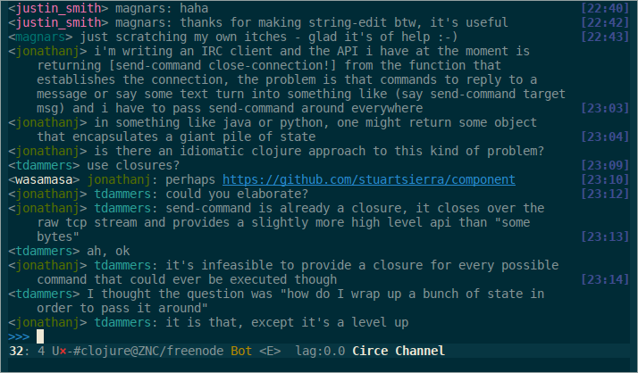

# Circe, a Client for IRC in Emacs

[](https://github.com/emacs-circe/circe/actions/workflows/ci.yaml)
[](http://stable.melpa.org/#/circe)

## Overview


Circe is a Client for IRC in Emacs. It tries to have sane defaults,
and integrates well with the rest of the editor, using standard Emacs
key bindings and indicating activity in channels in the status bar so
it stays out of your way unless you want to use it.

Complexity-wise, it is somewhere between rcirc (very minimal) and ERC
(very complex).

## Screenshot



## Installation

### Dependencies

In order to securely connect to an IRC server using TLS, Circe
requires an Emacs linked against the [GnuTLS](https://www.gnutls.org/)
library.

For displaying images, Circe requires
[ImageMagick](https://www.imagemagick.org/script/index.php).

### `package.el`

Make sure you have MELPA Stable added to your package sources. To your
.emacs, add this:

```Lisp
(require 'package)
(add-to-list 'package-archives
             '("melpa-stable" . "http://stable.melpa.org/packages/") t)
(package-initialize)
```

Then, use `package-install` to install Circe:

```
M-x package-install RET circe RET
```

After this, `M-x circe` should work.

### Development Version

In a shell:

```Shell
mkdir -d ~/.emacs.d/lisp/
cd ~/.emacs.d/lisp
git clone git://github.com/emacs-circe/circe.git
```

Then add the following to your `.emacs` file:

```Lisp
(add-to-list 'load-path "~/.emacs.d/lisp/circe")
(require 'circe)
```

The next time you start your Emacs, you should be able to use
`M-x circe` to connect to IRC.

## Connecting to IRC

To connect to IRC, simply use `M-x circe RET Libera Chat RET RET`.
This will connect you to Libera. You can join us on `#emacs-circe` by
using `/join #emacs-circe` in the server buffer.

A more elaborate setup would require you to edit your init file and
add something like the following:

```Lisp
(setq circe-network-options
      '(("Libera Chat"
         :tls t
         :nick "my-nick"
         :sasl-username "my-nick"
         :sasl-password "my-password"
         :channels ("#emacs-circe")
         )))

```

With this in your configuration, you can use `M-x circe RET Libera Chat
RET` to connect to Libera using these settings.

If the network you are connecting to supports client certificate authentication
and you have setup your certificate, you can tell circe to use it when login to
the network. You can enable SASL external authentication also if the network
supports it. An example to connect into Libera using a client certificate
could be:

```Lisp
(setq circe-network-options
      '(("Libera Chat"
         :tls t
         :tls-keylist (("/full/path/key.pem"
                        "/full/path/cert.pem"))
         :sasl-external t
         :nick "my-nick"
         :channels ("#emacs-circe")
         )))
```

Note that `sasl-external` is not required in order to be able to authenticate
using client certificates and not all the networks support it.

## Features

- Sensible defaults
- Tab completion
- Nick highlighting
- Automatically displaying images in channel
- Logging
- Spell checker
- Ignore feature that also hides users who talk to users on your
  ignore list
- Ignored messages can be toggled so they show up and then hidden
  again
- TLS/SSL support
- SASL authentication support (PLAIN and EXTERNAL methods)
- Client certificate authentication
- Nickserv authentication, automatic ghosting, and nick re-gain
- Auto-join
- Ability to reduce join/part/quit spam from lurkers
- Automatic splitting of long lines at word boundaries
- Netsplit handling
- Activity tracking in the mode line
- Fully customizeable message display
- Topic changes can be shown as a diff
- Automatic linking of Emacs Lisp symbols, RFCs, PEPs, SRFIs, Github
  issues, etc.
- Automatic splitting of outgoing messages at word boundaries to
  adhere to IRC protocol limitations
- Flood protection
- Nickname coloring (via the `circe-color-nicks` module)
- Lag monitoring (via the `circe-lagmon` module)
- Automatic pasting to a paste site for long messages (via the
  `lui-autopaste` module)
- Bar marking the last read position (via the `lui-track-bar` module)

## Documentation

Please see the Wiki for further information:

https://github.com/emacs-circe/circe/wiki
